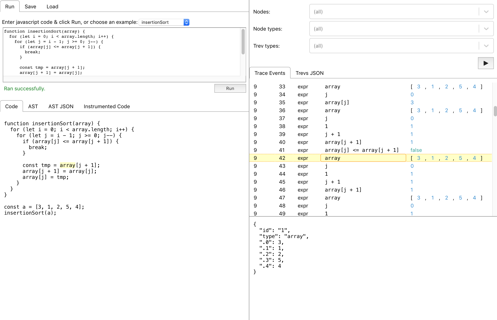

# blunt-instrument

This is a tool for tracing the execution of javascript code.
It does not require you to make changes to your source code; instrumentation is automated.
The instrumented code will report the value of every expression it evaluates, and other execution details such as the tree of function calls.

This can be used in a few ways:

- The UI lets you run code directly in the browser and explore the trace.
FIXME: link to UI
- The libraries can help you build interactive explanations of algorithms.
You can evaluate arbitrary code at runtime and get programmatic access to the full trace.
Jump to the [blunt-instrument-eval README][eval] to get started.
FIXME: link to example
- The Babel plugin can instrument your code for troubleshooting purposes.
See [example-plugin-config](packages/example-plugin-config) to see how.

Contents:

1. [Limitations](#limitations)
1. [Development](#development)
1. [Contributing](#contributing)
1. [License](#license)

## Limitations

- Currently the UI naively loads the entire trace into memory, so it can't handle large traces yet.
(Any fully-instrumented real-world software is going to produce large traces, so I'd like to fix this.)
- Support for `for await` loop syntax is not yet implemented.
- As mentioned in [Enabling and Disabling Tracing][enabling-disabling], turning the instrumenter on/off for individual lines currently has some gotchas.
- When tracing assignments such as `x.prop = z` or `x[index] = z`, the trace will include the initial value of `x` and the results of `index` and `z`, but not the final value of `x` after modification.
In the future an additional trace event type may be added to track the final value of `x`.
- When tracing method calls such as `x.y()`, the trace will include the value of `x` and the result of `x.y()`, along with the trace of the `y` method (if it was instrumented).
But it will not include the `x.y` function object itself.
(This might be fixed in the future, but it seems to be cumbersome to do without changing program semantics.)
- When tracing postfix increment/decrement operators `x++` or `x--` only the expression result (which is equal to `x`) is traced, not the new value after assignment.
In the future a trace event type may be added to track the effect of the assignment.
- When it encounters a `Proxy` object the tracer will log/display it as if it were the target object.
(I think it's impossible by design to universally detect when an object is a Proxy, but it seems possible via monkey-patching to track proxies that are created after the tracer initializes.
So this may be partially addressed in the future.)

## Development

Requires [node](https://nodejs.org) and [npm](https://www.npmjs.com).

Clone this repo and run `npm install` to install dependencies, then run `npx lerna bootstrap` to link the packages together.

This is a multi-package project managed using [lerna](https://github.com/lerna/lerna).
Each package is in a subdirectory of the `packages` folder.
Jest and Babel config are at the root and apply to all packages except `blunt-instrument-ui`, whose babel/webpack/jest config are managed by create-react-app.

Build and test commands can be run from the root directory.

Run `npm run build:cjs` or `npm run build:cjs:watch` to build the library packages.
You must do this before running tests, and you must rebuild a package before changes to it will affect other packages' tests.

Run `npm test` or `npm run test:watch` to run the unit tests.
**Note**: `test:watch` in the root directory will not run the UI's tests.
You can run `npm test` in `packages/blunt-instrument-ui` to watch the UI tests.

Run `npm start` to run the UI locally.

Run `npm run build` to build all packages, including the UI and ESM builds of the libraries.

## Contributing

Bug reports and pull requests are welcome on GitHub at https://github.com/brokensandals/blunt-instrument.

## License

This is available as open source under the terms of the [MIT License](https://opensource.org/licenses/MIT).

[eval]: packages/blunt-instrument-eval/README.md
[enabling-disabling]: packages/babel-plugin-blunt-instrument/README.md#enabling-and-disabling-tracing
